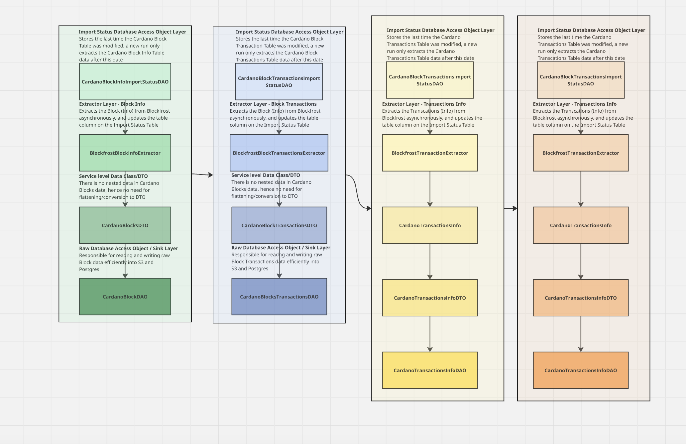

# Cardano 

The Cardano Tasks can be broken down into 3 main parts currently 

## 1) ETL Pipeline that siphons Cardano Blocks and Transactions data 
A non-realtime ETL pipeline that siphons blocks, block transactions, transactions (inclusive of UTXO) data periodically
at high throughput into S3 and Postgres, orchestrated by Airflow.

### Architecture (updated)

## 2) Cardano Data Analysis

Current Goal: Get the top 20 contracts on Cardano for the last 3 months based on transactions and active wallets

## 3) Cardano Proposals Analysis

The cardano grants are being broken down into 2 different types of sites:
- Ideascale: This was the site where proposals for Cardano Grant 9 were being hosted at
- Project Catalyst: This was the site where proposals from Cardano Grant 10 and beyond were being hosted at

The contents of the grants are being extracted using Selenium and Beautiful Soup.