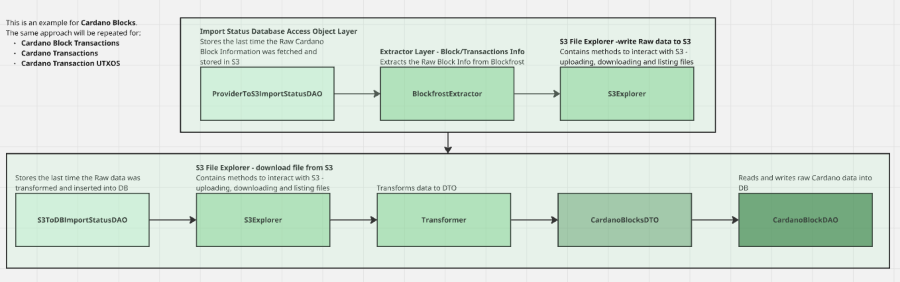

# Cardano 

The Cardano Tasks can be broken down into 3 main parts currently 

## 1) ETL Pipeline that siphons Cardano Blocks and Transactions data 
A non-realtime ETL pipeline that siphons blocks, block transactions, transactions (inclusive of UTXO) data periodically
at high throughput into S3 and Postgres, orchestrated by Airflow.

### Architecture (updated)



## 2) Cardano Data Analysis

Current Goal: Get the top 20 contracts on Cardano for the last 3 months based on transactions and active wallets


## 3) Cardano Proposals Analysis

The cardano grants are being broken down into 2 different types of sites:
- Ideascale: This was the site where proposals for Cardano Grant 9 were being hosted at
- Project Catalyst: This was the site where proposals from Cardano Grant 10 and beyond were being hosted at

The contents of the grants are being extracted using Selenium and Beautiful Soup.


## Project Setup

### Create venv and install dependencies

```commandline
poetry shell 
poetry install --no-root
```

### Setup postgres1@14

Project requires postgresql@14

Spin up a local instance of postgresql@14

```commandline
brew services start postgresql@14
```

Connect to the local instance, and create a new database

```commandline
psql -d postgres
CREATE DATABASE cardano;
```

Finally, use alembic to create the tables

```commandline
alembic upgrade head
```

## 

```commandline
psql -d postgres
CREATE DATABASE cardano
```

Finally, use alembic to create the tables

```commandline
alembic upgrade head
```

### Running the data pipeline to extract and load cardano block, block transactions, transactions and transaction utxo raw info to S3, transformed info to S3 and then to database

Step 1: Populate the .env file with environment variables

Step 2: Run the pipeline

```commandline
export PYTHONPATH=.
python src/etl_pipelines/cardano_blocks_to_s3_pipeline.py
python src/etl_pipelines/s3_to_db_cardano_blocks_pipeline.py
python src/etl_pipelines/cardano_block_transactions_to_s3_pipeline.py
python src/etl_pipelines/s3_to_db_cardano_block_transactions_pipeline.py
python src/etl_pipelines/cardano_transactions_to_s3_pipeline.py
python src/etl_pipelines/s3_to_db_cardano_transactions_pipeline.py
python src/etl_pipelines/cardano_tx_utxo_to_s3_pipeline.py
python src/etl_pipelines/s3_to_db_cardano_tx_utxo_pipeline.py
```

### To query the database (Postgresql)

Connect to the local instance, change database to crated database (cardano)

```commandline
psql -d postgres
\c cardano
```


## Connect to AWS EC2 Instance
